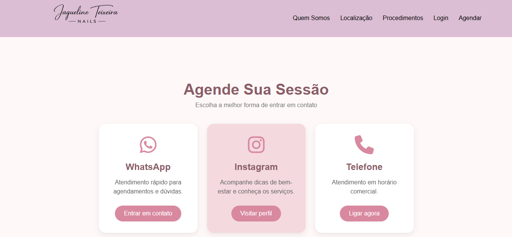
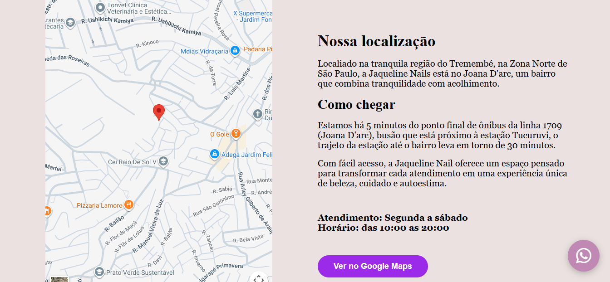

# 💅 Site Manicure

> Sistema web completo desenvolvido para um espaço de manicure, oferecendo uma interface moderna para os clientes e um backend em Node.js integrado ao MySQL para gerenciamento das informações.


---

# 📖 Sobre o projeto

O **Site Manicure** foi desenvolvido com o objetivo de criar uma plataforma para divulgação dos serviços de um salão de manicure, proporcionando uma experiência moderna, intuitiva e agradável para os clientes.

Além da interface desenvolvida em HTML, CSS e JavaScript, o projeto conta com um backend em **Node.js** responsável pela comunicação com um banco de dados **MySQL**, permitindo armazenar e recuperar informações de forma organizada.

Este projeto foi desenvolvido como prática de desenvolvimento Full Stack, envolvendo Front-end, Back-end e Banco de Dados.

---

# ✨ Funcionalidades

- Interface moderna e responsiva
- Página inicial personalizada
- Exibição dos serviços oferecidos
- Organização das informações do salão
- Integração entre Front-end e Back-end
- API desenvolvida em Node.js
- Banco de dados MySQL
- Estrutura preparada para futuras funcionalidades

---

# 🛠 Tecnologias utilizadas

### Front-end

- HTML5
- CSS3
- JavaScript

### Back-end

- Node.js
- Express.js

### Banco de Dados

- MySQL

### Bibliotecas

- Express
- MySQL2
- CORS


---

# ⚙️ Como executar o projeto

## 1️⃣ Clone o repositório

```bash
git clone https://github.com/allansouza07/Site_Manicure.git
```

---

## 2️⃣ Entre na pasta do backend

```bash
cd backend
```

---

## 3️⃣ Instale as dependências

```bash
npm install
```

---

## 4️⃣ Configure o banco de dados

Abra o MySQL Workbench e execute o arquivo

```
database.sql
```

para criar o banco de dados.

Depois configure as credenciais do banco no arquivo responsável pela conexão.

Exemplo:

```javascript
host: "localhost",
user: "root",
password: "SUA_SENHA",
database: "nome_do_banco"
```

---

## 5️⃣ Inicie o servidor

```bash
npm start
```

ou

```bash
node server.js
```

---

## 6️⃣ Execute o Front-end

Abra o arquivo

```
index.html
```

ou utilize uma extensão como:

- Live Server (VS Code)

---

# 🗄 Banco de Dados

O projeto utiliza MySQL para armazenar as informações.

O script de criação encontra-se em:

```
backend/database.sql
```


---

# 💡 Aprendizados

Durante o desenvolvimento deste projeto foram praticados conhecimentos em:

- Estruturação de projetos Full Stack
- HTML semântico
- CSS Responsivo
- JavaScript moderno
- Node.js
- Express
- APIs
- Banco de Dados Relacional
- Integração Front-end + Back-end
- Organização de código
- Git e GitHub

---

# 📷 Algumas imagens do sistema

## Página inicial


## Página de agendamento



## Localização




---

# 📌 Roadmap

- [x] Estrutura inicial
- [x] Desenvolvimento do Front-end
- [x] Desenvolvimento do Back-end
- [x] Integração com MySQL


---

# 🤝 Contribuições

Contribuições são sempre bem-vindas.

Caso tenha sugestões de melhorias, fique à vontade para abrir uma **Issue** ou enviar um **Pull Request**.

---

# 👨‍💻 Autores

**Allan Souza**

GitHub:

> https://github.com/allansouza07

LinkedIn:

> www.linkedin.com/in/allan-de-souza-2917622b9

<hr>

**Kelvin**

GitHub:

> https://github.com/K4lvin12

<hr>

**Carlos Monasterios**

GitHub:

> https://github.com/clmonasterios

<hr>

**Yuri Souza**

GitHub:

> https://github.com/inkyzx

---

# 📄 Licença

MIT LICENSE

---
